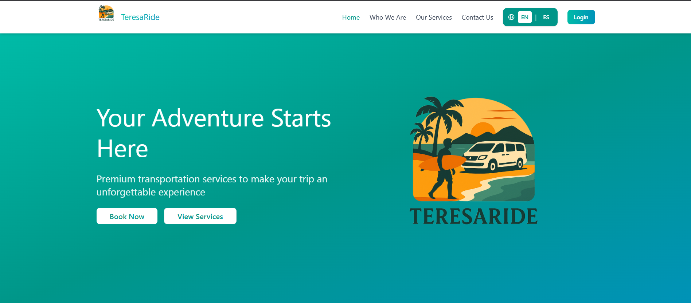
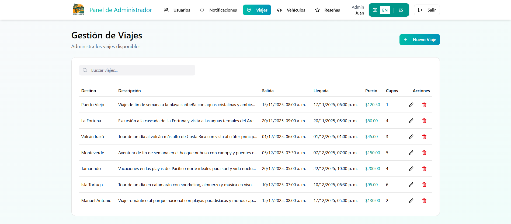

# 🚐 TeresaRide

Transportation and tour reservation platform designed for Santa Teresa, allowing users to book vehicles with drivers and reserve local tours through an intuitive web application.

---

# 📌 Description

TeresaRide is a full stack web platform inspired by ride-booking applications, focused on transportation and tourism services in Santa Teresa.

The system allows users to:

- Reserve transportation services
- Book tours
- Browse available vehicles
- Leave comments and reviews
- Make online payments through PayPal

The project was developed collaboratively as part of a Systems Analysis course, applying agile methodologies, CI/CD practices, and automated testing processes.

---

# ⚙️ Technologies Used

## 🎨 Frontend

- React.js
- JavaScript
- CSS

## ⚙️ Backend

- Node.js
- Express.js

## 🗄️ Database

- MySQL

## 🧪 Testing & QA

- Selenium
- Jest

## ☁️ Tools & Platforms

- Jenkins
- Figma
- Git

## 💳 Payment Integration

- PayPal API

---

# ✨ Features

✅ Vehicle reservation system  
✅ Tour booking management  
✅ PayPal payment integration  
✅ Vehicle catalog and availability  
✅ User comments and reviews  
✅ Responsive user interface  
✅ Full stack architecture  
✅ CI/CD practices with Jenkins  
✅ Automated testing with Selenium and Jest  

---

# 📊 System Workflow

1. Users browse available vehicles and tours  
2. Customers select and reserve transportation services  
3. Payments are processed using PayPal  
4. Reservation information is stored in MySQL  
5. Users can leave comments and reviews after their experience  
6. Automated testing validates critical system functionalities  

---

# 🎯 Project Goals

- Develop a scalable transportation reservation platform
- Apply full stack development practices
- Integrate secure online payment systems
- Improve software quality through automated testing
- Implement CI/CD workflows for collaborative development

---

# 👨‍💻 My Contributions

- Frontend vehicle module development
- Backend API development
- Database design and management
- Full stack feature implementation
- Collaborative development using agile methodologies

---

# 📷 Screenshots

